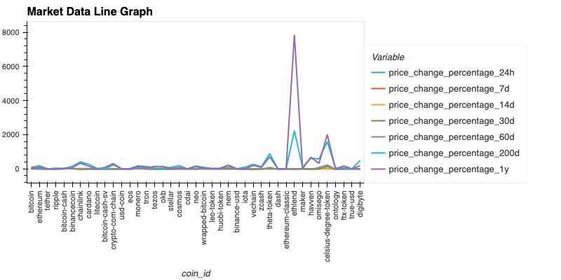
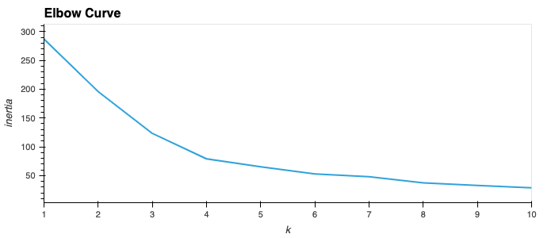
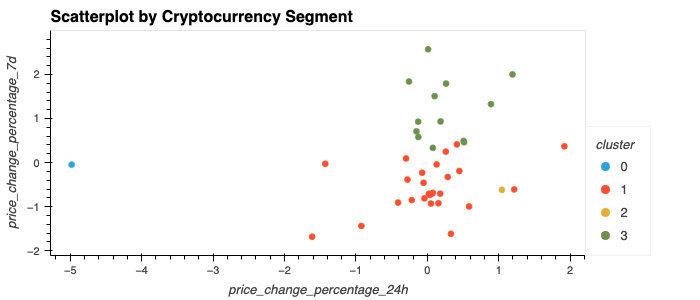
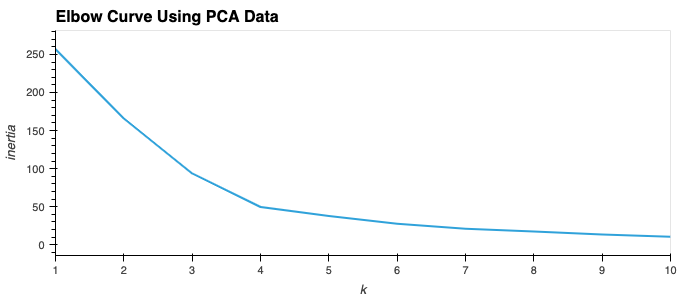
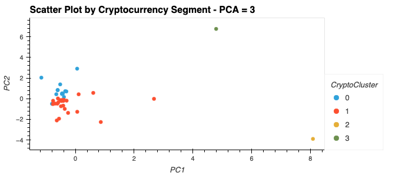

# Module 10 Challenge: Crypto Clustering

Assignment #7, Module 10 Challenge Assignment

## Background

As an advisor at one of the top five financial advisory firms in the world, we understand the market challenges. Competitors are fierce, so we want to propose a novel approach to assembling investment portfolios that are based on cryptocurrencies. Instead of basing your proposal on only returns and volatility, you want to include other factors that might impact the crypto market, leading to better performance for your portfolio.

When you present the idea, your manager loves it! So, you’re asked to create a prototype for submitting your crypto portfolio proposal to the company board of directors.

## Instructions

Original Instructions included in the Instructions.md file

### Set-up
Once we import the data, we can create a line chart to show the trends for the various cryptocurrencies.  This line graph is shown here:

### Part 1: Find the Best Value for k Using the Original Data

Using the elbow method, we can find the best value for k. Using this method and then plotting a line chart, we can see that the best value for k is 4.

### Part 2: Cluster Cryptocurrencies with K-means Using the Original Data

We use the K-means algorithm with a k value of 4 in order to cluster the cryptocurrencies.  We cluster them according to the price changes of the cryptocurrencies provided.

Using hvPlot, we then create a scatter plot to visualize the clusters.

### Part 3: Optimize Clusters with Principal Component Analysis

We then perform a principal component analysis (PCA) to reduce the features to three principal components.

To see how this analysis may affect the data, we look at the explained variance for this pca model.  In this case, the total explained variance of the three principal components is about 90%.  

### Part 4: Find the Best Value for k Using the PCA Data

Then, we will use the elbow method to find the best value for k by using the PCA data. Using this method and then plotting a line chart, we can see that the best value for k is 4. This is consistent with the best k value found using the original data.

### Part 5: Cluster Cryptocurrencies with K-means Using the PCA Data

Using the PCA data and the K-means algorithm a value of 4 for k, we cluster the cryptocurrencies according to the principal components.

Using hvPlot, we then create a scatter plot to visualize the PCA clusters.

### Part 6: Visualise and Compare the Results

Lastly, lets visually analyse the cluster analysis results by observing the outcome with and without using the optimization techniques.

Looking at the resulting elbow curves together, we can vizualize any differences.

We can then vizualize the two cryptocurrencies clusters together, one using the original data and the other the PCA data.

After visually analysing the cluster analysis results, we can better see the impact of using fewer features to cluster the data by using K-means.  We can see that by choosing fewer features to cluster the data we get a more condensed scatter plot.  Because the PCA model condenses all the features to three components, we filter out some of the outliers.  We can also see this when we look at the explained variance for the PCA model which in this case was about 90%.